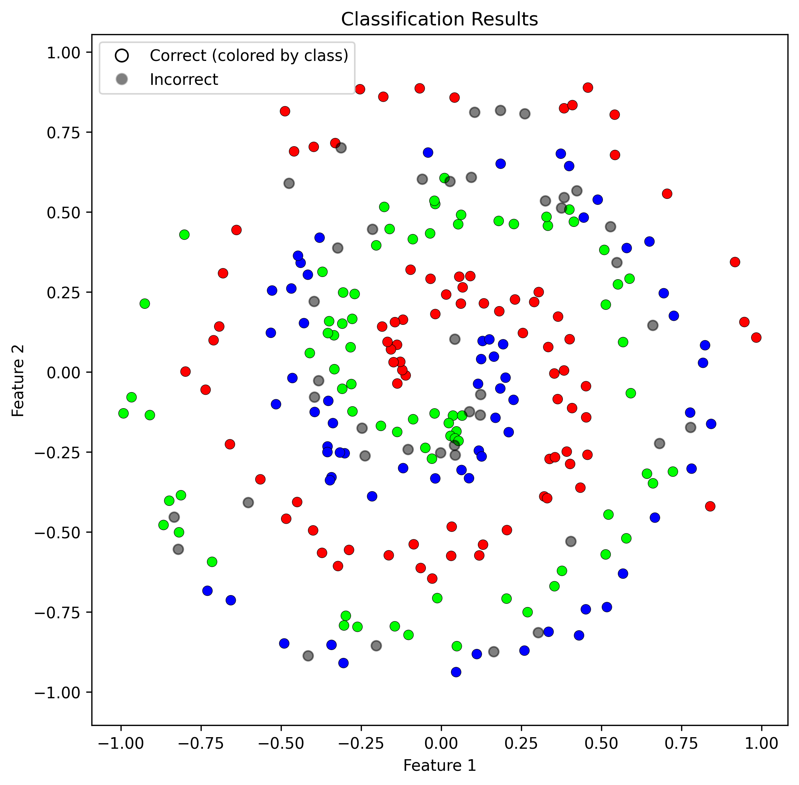

# Neural Networks From Scratch (NumPy)


This repository contains my implementation of **artificial neural networks from scratch in Python**, built in python, and then built in **CUDA C++** for much better performance.

The project follows and expands upon the *Neural Networks from Scratch* tutorial series by **Sentdex**, with the goal of deeply understanding how neural networks work internally, without relying on high-level frameworks understanding.

---

## Features

- Fully manual forward and backward propagation
- Dense layers, activation functions, and loss functions
- NumPy-only implementation (no TensorFlow / PyTorch)
---
# Implementations
Below is an implementation of my neural network on a spiral dataset, where it must classify a collection of points into their respective spirals.



Below is an implementation of my neural network on the MNIST dataset, where it reached 95.84% accuraccy on the validation dataset.


---

##  Requirements

```bash
pip install numpy matplotlib
```
---
